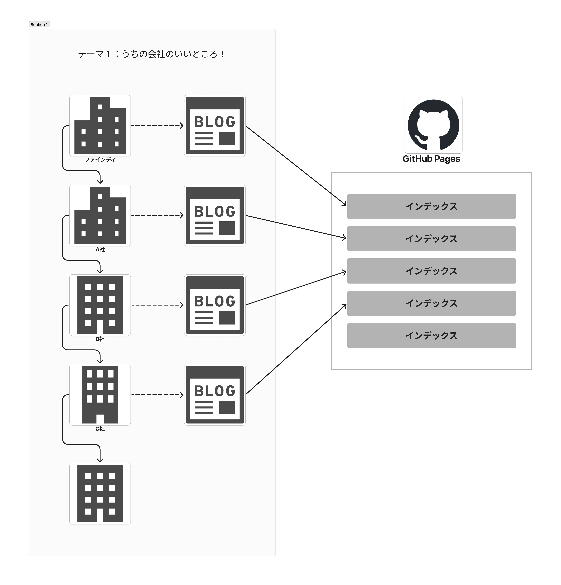

### 「テックブログで繋がる企業の輪（仮称）」趣意書

## 概要

テックブログを運営するIT企業が、リレー形式で「お題」に関する記事を書き、バトンを次の企業へ繋げるプロジェクトです。「企業間の交流を活性化し、テックブログを通じて情報を発信・共有する（古くて）新しい形」を目指します。

## 背景

企業のテックブログは、技術情報の共有や企業のブランディングにおいて重要な役割を果たしています。しかし、単独でブログを運営するだけでは読者層の広がりに限界があります。この企画は、複数の企業が協力して「テーマ」を決め、それに基づいた記事をリレー形式で執筆・公開していくことで、企業間のつながりを深め、より多くの読者にリーチすることを目指します。

## 企画の流れ

1. **お題設定**: 参加企業同士で共通のテーマを決定します。例：
   * 「私たちの開発組織の強みを教えます」
   * 「テックブログを継続する秘訣とは」
   * 「弊社にマッチする理想のエンジニア像」
2. **記事作成と公開**: 各企業が決められたお題に基づいて記事を執筆し、自社のテックブログで公開します。
3. **バトンの受け渡し**: 記事の最後に次の企業を紹介し、同じテーマで記事を執筆するようバトンを渡します。
4. **継続的なつながり**: バトンを次々に繋ぎ、企業間での交流や情報共有を継続して行うことで、テック業界全体の情報発信力を高めます。
5. **バトン記事のストック:** 本企画で寄稿されたブログ記事は、インデックスをストックすることでいつでも閲覧できる環境を構築します。また、ブログ記事の冒頭でこのストックページをリンクして頂くことで、過去記事へのリーチも期待できます。
   1. 記事ストックサイト、⁠プロトタイプ→ https://findy.github.io/TechBlog-Baton/

## 企画の目的

* **企業間のネットワーク拡大**: 参加企業間でのつながりを深め、交流の場を広げることができます。
* **テックブログの活性化**: 共通のテーマで複数の企業が記事を執筆することで、個別のブログ記事がより多くの読者にリーチし、コンテンツの幅を広げられます。
* **技術情報の共有**: お題に基づいた記事によって、異なる企業の視点からの技術的知見が共有され、業界全体の技術力向上に寄与します。
* **テックブログを始めるきっかけ作り**: まだテックブログを運営していない企業に対しては、この企画がきっかけとなり、最初の記事を執筆する手助けをします。これにより、情報発信をスムーズに開始し、業界全体におけるエンジニアのアウトプット文化を活性化を目指します。

## 企画名称

* 案
  * 『テックブログで繋がる企業の輪』
  * 『バトンでつなぐテックブログ！』

## 企画のゴール

* 参加企業が定期的にテーマに沿った記事を執筆し、バトンを通じて次の企業に繋げていくことで、業界内のコミュニケーションを活性化させる。
* 新たな読者層を開拓し、テックブログの認知度向上を目指す。

## 参加企業のメリット

1. **ブランド露出の拡大**: 他社のブログ読者にもリーチできる機会が得られます。
2. **技術力のアピール**: 共通テーマに対する自社の取り組みや視点を示すことで、技術力をアピールできます。
3. **人材採用への貢献**: 自社の文化や技術的取り組みを発信することで、潜在的な採用候補者へアプローチできます。
4. **業界動向の把握**: 他社の記事を通じて、業界の最新トレンドや各社の取り組みを学べます。

## 実施スケジュール

* 企画開始：2024年10月
* 第1回記事公開：2024年10月14日（仮）
* 以降、2〜4週間ごとに次の企業が記事を公開

## 参加条件

* 自社でテックブログを運営していること
* 指定されたお題に沿って記事を作成し、期限内に公開できること
* 次の参加企業を指名し、バトンを渡すこと

## 運営サポート

* 企画全体の調整と管理
* 参加企業間の連絡調整
* 全体スケジュールの管理
* 企画の告知と成果の取りまとめ

## 期待される効果

* IT業界全体の技術情報の質と量の向上
* 企業間の協力関係の強化
* 各社の採用活動支援
* テックブログ文化の更なる普及と定着

この企画を通じて、IT業界全体の発展と各社の成長に貢献できることを確信しています。皆様のご参加を心よりお待ちしております。

## 事務局（臨時）

ファインディ株式会社 高橋裕之 ：（専用MLかSlackチャンネルを用意する予定）
